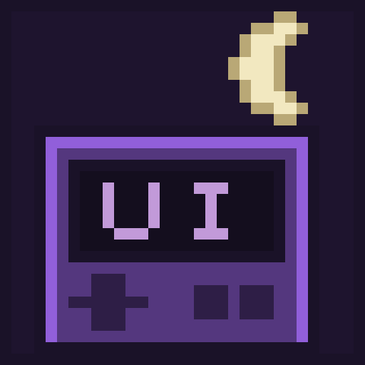

<p align="center">
  
</p>

<p align="center">
  <b>The nightly channel for the <a href="https://github.com/wild1walker/Gen1Wild">Gen1Wild</a> suite</b><br>
  The changes that are not in a release yet, listed where the game can install them.
</p>

## Add it in the game

**MODS > FIND MODS**, and add:

```
wild1walker/Gen1NightlyIndex
```

That is the whole setup. The nightly cart and its mods appear beside anything
else you have indexed, and each night's build lands on the cards on its own.

There is also a page: **<https://wild1walker.github.io/Gen1NightlyIndex/>**

## Read this part

**These are test builds.** They exist so changes can be played before they
reach the cart everybody else is on, which means they can be broken in ways a
release is not. That is the deal, and it is the only reason to install one.

**Your stable game is untouched.** Every mod listed here installs under an id
of its own and **conflicts with its stable twin on purpose** — run one or the
other, never both. Nothing here can reach
[Wild Green](https://github.com/wild1walker/Gen1WildGreen)'s saves, its
settings or its cartridge. The nightly cart has its own save slots like any
other cart, and its cartridge is **dark purple** with `NIGHTLY` under the
wordmark so you can tell at a glance which one you are opening.

The stable index is [Gen1Wild](https://wild1walker.github.io/Gen1Wild/), and
adding both is fine — neither feed knows about the other.

## What is in it

### The cart

| | Cart | What it is |
|---|---|---|
|  | **Wild Green Nightly** | Wild Green, built from the branch. The same four mods the stable cart pins, two of them nightly. Sealed like the stable cart, so it can still go online — with other people running this same nightly. |

### The mods in it

| | Mod | What it is |
|---|---|---|
|  | **Gen1WildUI Nightly** | The visual half of the suite, plus a `UI THEME` row on the OPTION screen: `LIGHT`, `DARK` or `COLORFUL*`. |
|  | **Wild Green Nightly** | The player in green, the names, and the title screen — with `PLAYER` live and the title's colours right in every display mode. |

**Gen1WildQOL is not forked.** Nothing in the current work touches it, and a
fork with no changes in it is a fork that only rots, so the nightly cart pins
the released one exactly as the stable cart does.

## What is in this nightly

### A dark mode, and a colourful one

`START > OPTION > UI THEME`. `LIGHT` is the default and is exactly what the
cart looked like before.

Every page the suite draws is black and white on purpose, so **`DARK`** is
literally that: paper black, ink white, and the two shades between them
swapped. It reaches the Pokédex, the box, the party menu, the bag, the item
screens, the mod manager and the suite's own settings. The overworld, the
battles and the title screen are pictures rather than pages, and are left
alone.

**`COLORFUL`** tints each page by what the screen *is* — the Pokédex red, the
box blue, the party the green of a full HP bar, the bag leather, the mart gold
— and colours the settings cards by what they open, so you pick one by colour
before you have read the word. Nothing shouts: every tint holds the lightness
the black-and-white page had, so no word is harder to read than it was. The
asterisk is real — the battle command grid's four buttons are not coloured yet.

### The title screen is the right colour again

`WILD GREEN VERSION` read yellow-green on pale yellow, half the POKE BALL was
skin-coloured, and so was the highlight on the copyright line. One bug, in one
place, and it is fixed in every display mode now.

### The version ribbon follows `PLAYER`, and `PLAYER` is live

Put the character in purple and the title is lettered in purple — the words
still say `GREEN`. And changing the colour no longer waits for a relaunch: the
walker changes under your feet.

## How this repository works

It is an index and nothing else: **no mod is vendored here.** Every card points
at a release in [Gen1NightlyMods][mods], and installing from one runs the same
zip import **Import mod .zip** does.

```
mods/Wild@<id>/     meta.json, description.md, thumbnail.png -- one mod's card
carts/Wild@<id>/    the same three, for a cart
site/data/index.json    the feed the game reads, built hourly
tools/build_index.py    builds it, resolving each release from GitHub
tools/make_icons.py     draws the icons: 32x32 grids, no library, no font
tools/make_favicon.py   draws the tab icon from the same crescent
```

A cart listing never carries hand-copied pins. It declares `cart_source` and
the pins are read from that repo's own `cart.json` on every rebuild, and its
thumbnail is fetched from the cartridge the cart itself draws — so a card and
the thing it lists cannot drift apart.

Every icon here is on the same night purple and carries the same crescent, so
a card reads as a nightly before it has been read at all.

## Licence

MIT, like everything it lists.

[mods]: https://github.com/wild1walker/Gen1NightlyMods
